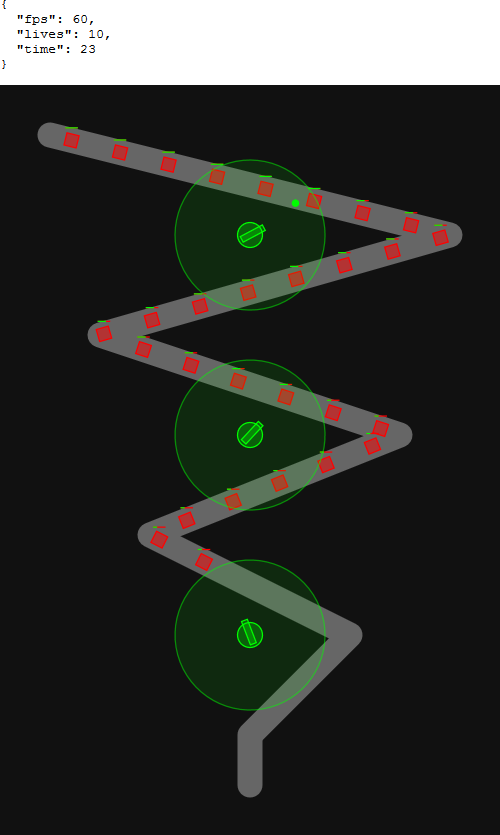

# td-engine

A JavaScript engine for building tower defense games in the browser

Requires a browser that supports [import/export](https://developer.mozilla.org/en-US/docs/Web/JavaScript/Reference/Statements/import),
eg Chrome, or Firefox with `dom.moduleScripts.enabled` in `about:config`

Currently at early prototype stage

## TODO

### short term

- optimize back to steady 60fps - test on slower machines too
- sell towers
- upgrade towers
- creeps come in waves
- pause
- load and save
- level progression
- scale to viewport

### mid term

- add more tower types
- add more creep types

### long term

- pixi.js client - faster
- electron app
- towers that can aim ahead of creeps - just shooting fast is OK for now, it's
  how heaps of TDs handle it
- different targeting modes, at moment towers target closest
- difficulty
- allow multiple paths through map
- allow levels with no predefined paths, creeps pathfind from start to exit
- levels with tower slots ala Kingdom Rush
- offensive units ala Kingdom Rush
- levels where towers block path and creeps attack towers ala Plants vs Zombies
- make an actual game
